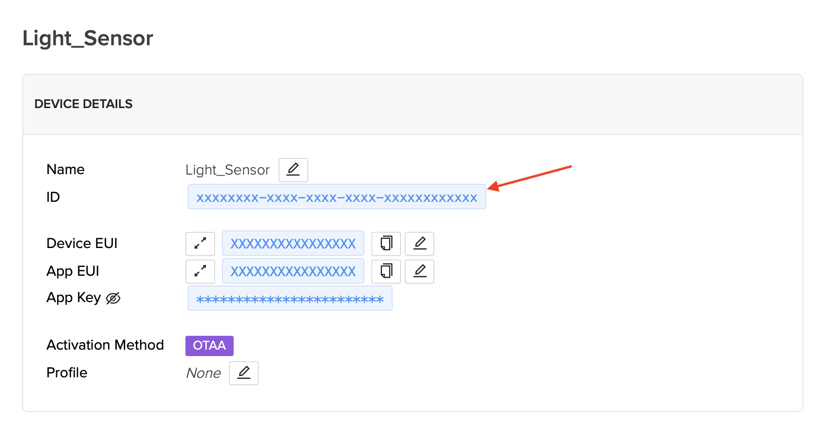

# Homebridge Helium IOT

This plugin is an unofficial Helium API to provide the ability to access read-only IOT devices using the Helium Network.

## Installation

Assuming a global installation of homebridge:
`npm install -g --unsafe-perm homebridge-helium-iot`

## Setup

This plugin supports [homebridge-config-ui-x](https://www.npmjs.com/package/homebridge-config-ui-x) for visual config setup & modification.

You will need:

- A Helium Console Account w/ devices connected

### Generating an API Key

You can generate an API key for the Helium Console [here](https://console.helium.com/profile). _Note: You can only see this key once on the dashboard - save this key in a safe place._

### Device ID

You can find your Helium Device ID within your Console --> Devices --> [Select A Device] --> ID (as shown below).



## Port

The port that the payload is available via can often by found with the user manual for your device. Common ports for different manufacturers can be found below.

## Manual Config

Add the below to your `config.json` located inside your `.homebridge` folder, updating credentials & adding any additional devices.

```json
{
  "platform": "HeliumIOTPlatform",
  "api_key": "HELIUM_CONSOLE_API_KEY",
  "devices": [
      {
          "name": "ANY_DEVICE_NAME",
          "type": "DEVICE_TYPE",
          "device_id": "HELIUM_DEVICE_ID",
          "manufacturer": "ANY_MANUFACTURER_NAME",
          "port": PAYLOAD_PORT_NUMBER,
          "serial_number": "ANY_SERIAL_NUMBER",
          "model": "ANY_MODEL_NAME",
          "refresh_duration": 300 // Refresh duration in seconds. Min 60 seconds
      }
  ]
}
```

## Current Supported Devices

### Browan

| **Device Name**      | **Model Number**                            | **Config Type**                | **Payload Port** |
|----------------------|---------------------------------------------|--------------------------------|------------------|
| Ambient Light Sensor | **TBAM100-868** (EU) / **TBAM100-915** (US) | `BROWAN_AMBIENT_LIGHT_TBAM100` | `104`            |

_Device not available? Please open an Issue/PR!_
